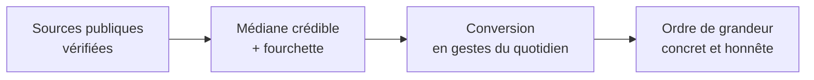
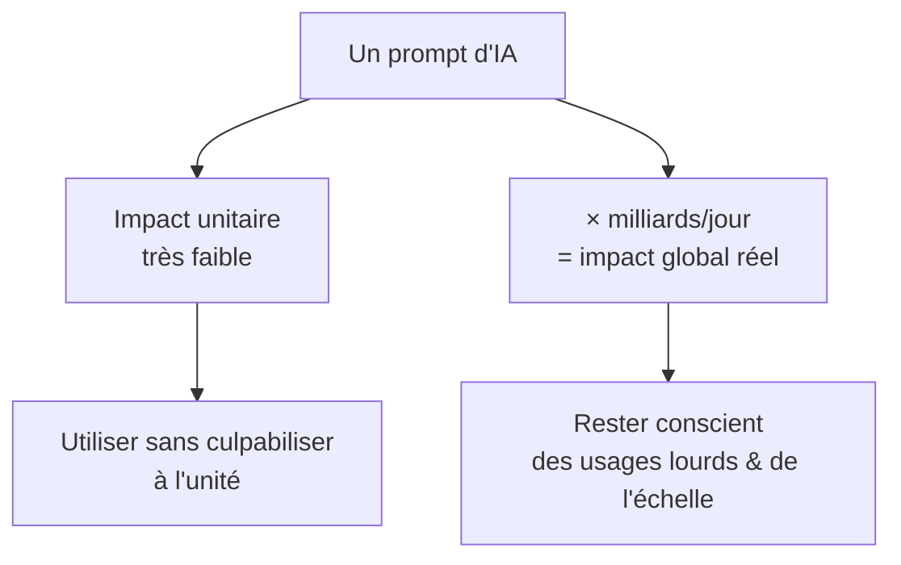

# À propos

## Notre but

**HowManyPrompts a un but purement informatif** : remettre à sa juste place la consommation réelle d'un prompt d'IA générative. On la met en regard des gestes du quotidien, et même d'une simple recherche Google, pour donner des **ordres de grandeur concrets** plutôt que des impressions.

L'objectif n'est ni de **diaboliser** l'IA, ni de la **survendre**. Les grands modèles de langage (LLM) sont des outils qui font gagner du temps, déjà intégrés au quotidien de centaines de millions de personnes ; comme toute technologie, ils consomment des ressources. Comprendre cette consommation, sans catastrophisme ni déni, c'est pouvoir les utiliser de façon **lucide**.

## D'où viennent les chiffres

Toutes les données proviennent de **sources publiques et vérifiées** : agences publiques (ADEME, US EPA / DOE / EIA, EEA), instituts de recherche et publications scientifiques (Water Footprint Network, *Our World in Data* d'après Poore & Nemecek, arXiv), l'Agence internationale de l'énergie (IEA), et les chiffres officiels des acteurs de l'IA (Google, OpenAI, Epoch AI).

Quand les sources **divergent**, on retient une **médiane crédible** et on affiche la **fourchette** : des ordres de grandeur honnêtes, jamais une fausse précision. Chaque valeur est datée et reliée à sa source (voir la page **Sources**).

## Mettre un prompt en perspective

Un prompt texte moyen consomme de l'ordre de **0,3 Wh**, **0,3 mL d'eau** et **0,2 g de CO₂** — soit à peu près l'énergie d'une **recherche Google**, et quelques gouttes d'eau. À l'unité, c'est minuscule.

<svg viewBox="0 0 600 170" xmlns="http://www.w3.org/2000/svg" role="img" aria-label="Comparaison d'énergie : 1 prompt vs gestes du quotidien">
  
  <text x="0" y="20" class="lbl">1 prompt IA (0,3 Wh)</text>
  <rect x="230" y="10" width="3" height="14" class="bar"/>
  <text x="240" y="21" class="val">≈ recherche Google</text>

  <text x="0" y="60" class="lbl">Bouilloire 1 tasse</text>
  <rect x="230" y="50" width="73" height="14" class="bar"/>
  <text x="312" y="61" class="val">22 Wh (~73×)</text>

  <text x="0" y="100" class="lbl">Aspirateur 10 min</text>
  <rect x="230" y="90" width="180" height="14" class="bar"/>
  <text x="418" y="101" class="val">90 Wh (~300×)</text>

  <text x="0" y="140" class="lbl">Four 1 heure</text>
  <rect x="230" y="130" width="360" height="14" class="bar"/>
  <text x="230" y="162" class="val">2 100 Wh (~7 000×)</text>
</svg>

Mais l'unité n'est pas toute l'histoire : **multipliée par des milliards de requêtes par jour**, la consommation devient significative à l'échelle mondiale. Les deux choses sont vraies en même temps — c'est justement ce que ce site aide à visualiser.

## Le débat, honnêtement : deux lectures

Sur l'impact de l'IA, deux camps coexistent, et **chacun a des arguments solides**. On les présente côte à côte.

| 🟢 « L'IA, ce n'est pas si lourd » | 🟠 « Restons vigilants » |
|---|---|
| L'impact **unitaire** est faible : ~0,3 Wh, comparable à une recherche Google *(Google, OpenAI, Epoch AI)*. | **L'effet d'échelle** est réel : ~2,5 milliards de prompts/jour ; les data centers pèsent déjà ~1–1,5 % de l'électricité mondiale et croissent vite *(IEA)*. |
| L'**efficacité progresse** : les nouveaux modèles consomment moins par requête *(Google : 0,24 Wh)*. | Les modèles de **raisonnement** et surtout la **vidéo** consomment beaucoup plus (jusqu'à ×1 000). |
| Des **bénéfices concrets** : productivité, aide au diagnostic médical, recherche climatique, accessibilité *(PwC, UC, Conseil de l'UE)*. | **Eau et stress hydrique local** autour des data centers *(UC Riverside, Water Footprint Network)*. |
| Comparé à d'autres usages (streaming, viande, voiture, avion), l'IA reste modeste par personne. | **Emploi, biais, vie privée, concentration** du pouvoir : jusqu'à ~40 % des heures travaillées pourraient être touchées *(WEF, ILO, Stanford HAI)*. |

## IA et emploi : une transformation, pas une nouveauté

Comme à chaque grande révolution — l'industrie, puis le web — **des métiers se transforment ou disparaissent pendant que d'autres émergent**. L'IA générative s'inscrit dans cette continuité. Les études *(WEF « Future of Jobs », OCDE, PwC)* pointent surtout une **transformation des tâches** plutôt qu'un remplacement pur : l'outil augmente l'expert plus qu'il ne le remplace, notamment là où le jugement, la responsabilité et le contexte humain restent décisifs.

## Notre position

Ni technophiles béats, ni technophobes. Nous pensons que **rester conscient de l'évolution de l'IA, de ses usages et de ses coûts** est la meilleure façon d'en tirer parti — **sans naïveté ni peur**. Ce site donne les chiffres ; les conclusions, chacun se les fait.

## Transparence

Fabriquer ce site (recherche + conception assistées par IA) a coûté un ordre de grandeur modeste — l'équivalent de quelques heures de télé. On l'affiche aussi, par cohérence : on ne demande pas aux autres une transparence qu'on ne s'applique pas.

---

*HowManyPrompts est édité par GHIS. Données indicatives, mises à jour régulièrement — voir la page **Sources** pour la liste complète et les dates.*
