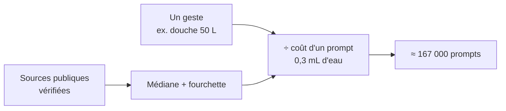
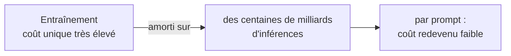

# Méthodologie

Comment on transforme un geste du quotidien en « nombre de prompts ». **Tout est honnête et fourchetté** : des ordres de grandeur, jamais une fausse précision.

> **SEO** : page à fort potentiel (« combien consomme un prompt / ChatGPT »). Balisage **JSON-LD `FAQPage`** sur la section FAQ + **`HowTo`** possible sur la formule. Ancres par question, liens internes vers `/sources`, `/glossaire`, `/comparatif` et le jeu.

---

## En bref

On part de la consommation **mesurée et sourcée** d'un geste, on la divise par la consommation d'**un prompt**, et on obtient son équivalent en prompts d'IA. Rien d'autre.

---

## Combien consomme un prompt d'IA ?

Pour un **prompt texte moyen** (l'*inférence* d'un grand modèle de langage, ou LLM, de type GPT-4o) :

| Ressource | Valeur retenue | Fourchette crédible | Sources |
|---|---|---|---|
| ⚡ Électricité | **0,3 Wh** | 0,24–0,4 Wh | Google (0,24) · Epoch AI (0,30) · OpenAI (0,34) |
| 💧 Eau (refroidissement direct) | **0,3 mL** | 0,26–0,32 mL *(≈1,5 mL avec l'amont électrique)* | Google · OpenAI |
| 🌍 CO₂ | **0,2 g** | 0,15 g (opérationnel) → ~1 g (cycle de vie) | dérivé 0,3 Wh × intensité réseau |

On ne compte que **l'inférence** (l'usage), pas l'entraînement. Les requêtes de **raisonnement** (~15–40 Wh) et la génération d'**images** (~6–12 Wh) ou de **vidéos** (~940 Wh/5 s) coûtent bien plus — voir le glossaire.

---

## La formule

> **prompts = consommation du geste ÷ consommation d'un prompt**

Trois exemples, un par métrique :

| Geste | Calcul | Résultat |
|---|---|---|
| 🚿 Douche 5 min (~50 L d'eau) | 50 000 mL ÷ 0,3 mL | ≈ **167 000 prompts** |
| 🔥 Four 1 h (~2,1 kWh) | 2 100 Wh ÷ 0,3 Wh | ≈ **7 000 prompts** |
| 🚗 1 km en voiture (~170 g CO₂) | 170 g ÷ 0,2 g | ≈ **850 prompts** |

C'est toute la mécanique du jeu : chaque geste ajouté est converti en son équivalent en prompts, puis comparé à un « budget » d'IA.

---

## Eau et CO₂ « virtuels »

Pour les **aliments et objets**, on compte l'empreinte de **production** (eau et CO₂ « virtuels »), pas seulement l'eau du robinet du repas. Un burger « coûte » surtout par l'élevage (~2 500 L d'eau virtuelle), pas par le verre d'eau à côté. On l'indique clairement pour ne pas comparer des choux et des carottes : une chasse d'eau (eau directe) et un steak (eau virtuelle) ne mesurent pas la même chose.

---

## Les échelles : quel « budget » d'IA ?

Le budget qu'on cherche à « dépenser » correspond à une **consommation réelle d'IA** :

| Échelle | Budget (prompts) | Base |
|---|---|---|
| 🧍 Toi (1 an) | 12 000 | usage intensif ≈ 33 prompts/jour |
| 👥 100 personnes (1 an) | 1 200 000 | 12 000 × 100 |
| 📅 ChatGPT en 1 jour | 2 500 000 000 | ~2,5 Md prompts/jour *(OpenAI, 2026)* |
| 🌍 Toute l'IA générative (1 an) | ~1 100 000 000 000 | ChatGPT ~900 Md/an ÷ ~80 % du marché |

On ne suppose **pas** que tout le monde utilise l'IA : les grandes échelles reposent sur l'**usage observé** (2,5 milliards de prompts par jour), pas sur la population mondiale. On voit ainsi combien peu de gestes du quotidien suffisent à « valoir » l'IA d'une journée entière de ChatGPT.

---

## Pourquoi des fourchettes plutôt qu'un chiffre exact ?

Les sources varient (mix électrique, méthode de mesure, périmètre). On retient une **médiane crédible** et on **affiche la fourchette**. Deux exemples parlants :

- **Vol** : selon qu'on intègre ou non le **forçage radiatif** (×~1,9 chez DEFRA/ADEME ; CO₂ seul chez l'ICAO) et qu'on compte l'aller ou l'aller-retour, le chiffre varie du simple au double.
- **Bœuf** : de ~**60** à ~**99 kg CO₂e/kg** selon le type d'élevage.

Afficher la fourchette, c'est refuser la **fausse précision**.

---

## Et l'entraînement des modèles ?

Il compte, et il est loin d'être négligeable : entraîner un LLM peut consommer de l'ordre du **gigawattheure** d'électricité, parfois bien davantage — l'équivalent de centaines de foyers sur une année entière.

C'est toutefois un **coût unique**, amorti sur les centaines de milliards d'inférences qui suivent ; ramené à un seul prompt, il redevient faible. **Le site ne chiffre que l'inférence** (l'usage quotidien, celui sur lequel chacun a prise), mais l'entraînement fait bel et bien partie de l'empreinte globale de l'IA — on le dit clairement plutôt que de le cacher.

---

## FAQ

**Combien consomme un prompt d'IA ?**
Pour un prompt texte moyen : ~0,3 Wh d'électricité, ~0,3 mL d'eau de refroidissement direct, ~0,2 g de CO₂. On ne compte que l'inférence, pas l'entraînement.

**Comment calculez-vous le « coût en prompts » d'un geste ?**
On divise la consommation du geste par celle d'un prompt : *prompts = valeur du geste ÷ coût d'un prompt*. Une douche de 50 L ≈ 50 000 mL ÷ 0,3 mL ≈ 167 000 prompts.

**Pourquoi 12 000 prompts par an et par personne ?**
C'est une hypothèse d'usage intensif (≈ 33 prompts/jour). Les échelles plus grandes ne multiplient pas par la population mondiale : elles reposent sur la consommation réelle de l'IA (ChatGPT ≈ 2,5 milliards de prompts/jour).

**Eau et CO₂ « virtuels », c'est quoi ?**
Pour les aliments et objets, on compte l'empreinte de production (eau/CO₂ « virtuels »), pas seulement l'eau du robinet.

**Pourquoi des fourchettes plutôt qu'un chiffre exact ?**
Parce que les sources varient. On retient une médiane crédible et on affiche l'écart : des ordres de grandeur honnêtes, pas une fausse précision.

**Et l'entraînement des modèles ?**
Coûteux mais unique, amorti sur des centaines de milliards de requêtes ; par prompt, il redevient faible. Le site chiffre l'usage (l'inférence), tout en reconnaissant que l'entraînement fait partie de l'empreinte globale.

---

*Toutes les valeurs sont datées et reliées à leur source sur la page **Sources**.*
